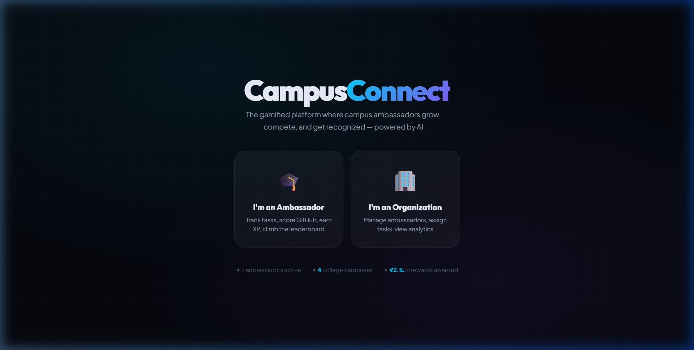
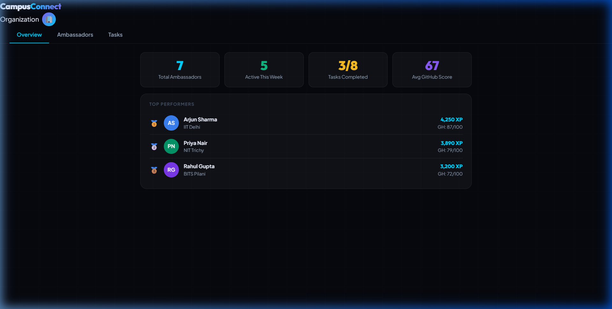
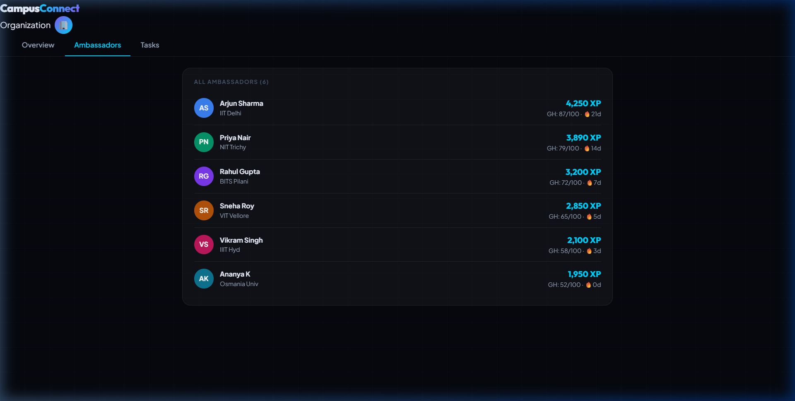
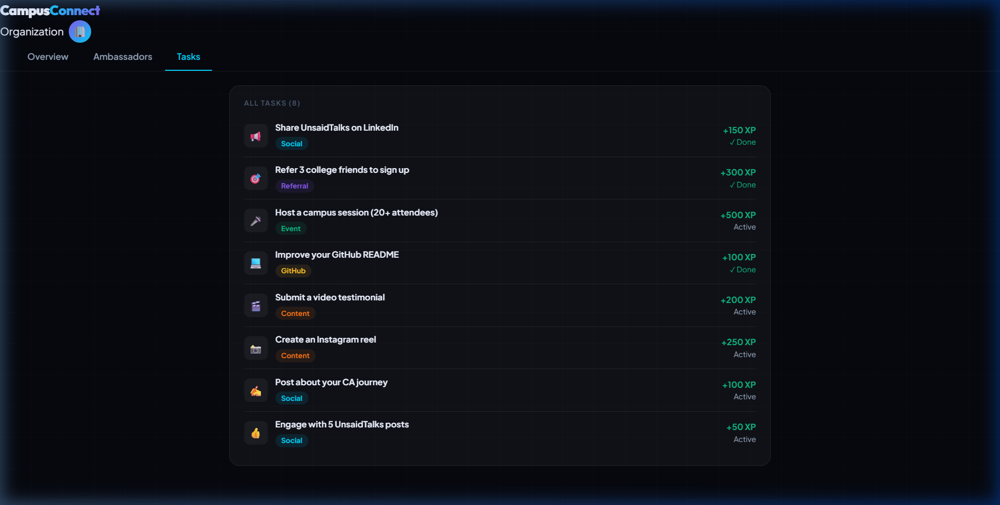
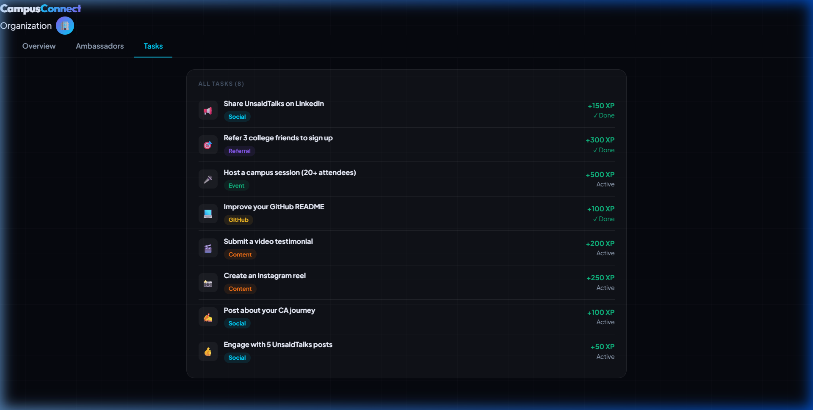

# CampusConnect 🚀
*The Gamified Platform Where Campus Ambassadors Grow, Compete, and Get Recognized.*

**Built for the AICore Connect Hackathon**

---

## 📺 Demo Video
> **Note:** Watch the demo video below to see the platform in action!
<!-- REPLACE_WITH_VIDEO_LINK_OR_GIF -->
Link to Video - https://github.com/093rjain-ro/campusconnect/issues/1

---

## 🌟 Overview
**CampusConnect** is a fully standalone, gamified Single-Page Application (SPA) designed to solve the problem of student engagement and campus ambassador program management. 

It provides an end-to-end experience where:
- **Ambassadors** can complete tasks, analyze their GitHub profiles using AI, earn XP, unlock badges, and compete on a live leaderboard.
- **Organizations** can track total engagement, manage ambassadors, and measure ROI directly through a seamless dashboard.

## ✨ Key Features
- **Sleek UI/UX**: Built entirely without heavy frameworks, utilizing Vanilla JS, CSS Grid/Flexbox, and dynamic micro-animations for a 10/10 visual experience.
- **Role-Based Workflows**: Separate, tailored experiences for `Ambassadors` and `Organizations`.
- **Gamification Engine**: Real-time XP tracking, level progression, and daily quests.
- **AI GitHub Analyzer**: Calculates a recruiter-ready score based on real GitHub data and provides tailored feedback.
- **Mock Google Login Flow**: A simulated, beautiful onboarding process designed specifically for seamless hackathon demonstrations without complex backend dependencies.

## 💻 Tech Stack
- **Frontend**: HTML5, CSS3, Vanilla JavaScript (ES6+)
- **Architecture**: Single-File Component architecture with custom DOM generation.
- **APIs**: GitHub Public API for profile analysis.
- **Design Aesthetic**: Glassmorphism, tailored dark mode, smooth gradient animations.

## 🚀 How to Run Locally
Since the application is a standalone prototype, running it is incredibly simple:
1. Clone the repository.
2. Open `index.html` in any modern web browser.
3. *Alternatively*, run it with a local server:
   ```bash
   npx http-server -p 8080
   ```
4. Navigate to `http://localhost:8080`.

## 🗂️ Projects
This repository contains two distinct projects, also viewable in the app's **Projects** tab.

### 1. CampusConnect
- **Tag:** Hackathon, AICore Connect
- **Users:** Ambassadors, Organizations
- **Features:** XP, levels and daily quests; AI GitHub profile analyzer; live leaderboard and badges; role-based dashboards
- **Tech Stack:** HTML5, CSS3, Vanilla JS, GitHub Public API
- **Status:** Working prototype with demo video and screenshots

### 2. Campus Placement & Recruitment Drive Management System (Project 22)
- **Tag:** Academic, DBMS Project 22
- **Subtitle:** A database design that keeps one correct record from student registration up to final offer, replacing the scattered sheets, forms and messages used by placement cells.
- **Problem:** ineligible students may get included by mistake; the same student can appear more than once for a drive; round results and offer status drift out of sync.
- **Users:**
  - Placement officer: create drives, set eligibility, enter results, issue offers
  - Student: view drives, apply, track status
  - Recruiter: check applicants, review shortlists, confirm selections
  - Admin: manage access, maintain master data, support reports
- **Main functions:**
  - Master data: student, department, skill, company and job details
  - Drive processing: create drives, check eligibility, allow one valid application per student per drive
  - Results and reporting: store round results, issue offers, generate shortlist and placement reports
- **Process flow:** Student data -> Drive setup -> Eligibility check (CGPA, marks, backlogs, skills) -> Application -> Rounds and offer (aptitude, technical, HR)
- **Entities (13):** Department, Student, AcademicRecord, Skill, StudentSkill, Company, JobProfile, Drive, EligibilityCriteria, Application, Round, RoundResult, Offer
- **Key relationships:** one department has many students; student-skill is many-to-many through StudentSkill; one company has many job profiles and drives; one drive has many applications, rounds and offers; Application links Student and Drive; RoundResult links Round and Student; Offer is given only after the student clears the process
- **Key rules to enforce in Review 2:** one application per student per drive; only eligible students may apply; CGPA and marks stay in a valid range; rounds stored in proper order
- **Why the rules matter:** prevent duplicate data, reduce human error, make reports reliable, improve fairness
- **Next steps:** normalize to 3NF, write DDL and constraints, insert sample data, build a small front end
- **Status:** Review 1 complete (problem, scope, users, functions, ER diagram, initial relational schema)

## 📸 Screenshots

<p align="center">
  
  <br/><br/>
  
  <br/><br/>
  
  <br/><br/>
  
  <br/><br/>
  
</p>

*Hackathon Submission by Rohan Jain*
